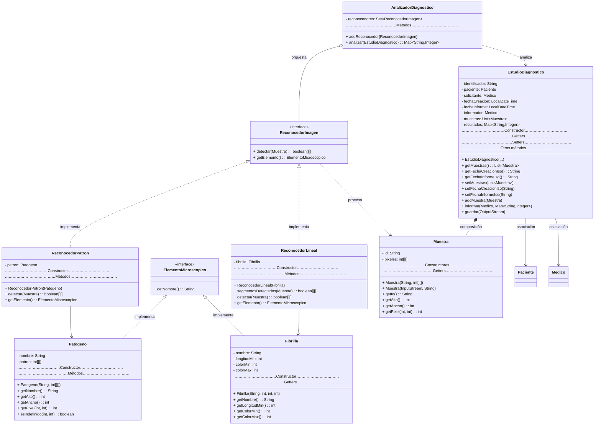

<br/><br/>
<br/><br/>


# Práctica 3: Integración del análisis de imágenes en el estudio diagnóstico


## Contenido


- [Práctica 3: Integración del análisis de imágenes en el estudio diagnóstico](#práctica-3-integración-del-análisis-de-imágenes-en-el-estudio-diagnóstico)
  - [Introducción](#introducción)
  - [Objetivos](#objetivos)
  - [Requisitos previos](#requisitos-previos)
  - [Temas relacionados con la práctica](#temas-relacionados-con-la-práctica)
  - [Actividades de la práctica](#actividades-de-la-práctica)
    - [Crear el proyecto en Eclipse](#crear-el-proyecto-en-eclipse)
    - [Extender la clase `EstudioDiagnostico`](#1-extender-la-clase-estudiodiagnostico)
    - [Actualizar la clase `Muestra` con E/S](#2-actualizar-la-clase-muestra-con-es)
    - [Implementar las interfaces](#3-implementar-las-interfaces)
    - [Adaptar `ReconocedorPatron` a la interfaz](#4-adaptar-reconocedorpatron-a-la-interfaz)
    - [Integrar `ReconocedorLineal` (proporcionado)](#5-integrar-reconocedorlineal-proporcionado)
    - [Desarrollar `AnalizadorDiagnostico`](#6-desarrollar-analizadordiagnostico)
    - [Implementar persistencia XML](#7-implementar-persistencia-xml)
    - [Probar el sistema completo](#8-probar-el-sistema-completo)
    - [Exportar el proyecto](#exportar-el-proyecto)
  - [Evaluación](#evaluación)


## Introducción


### Contexto de la práctica


En las prácticas 1 y 2 desarrollamos las bases de un sistema de gestión de estudios diagnósticos y un algoritmo básico de reconocimiento de patrones para identificar patógenos en muestras médicas. En esta tercera práctica **integraremos todos estos componentes** en un sistema completo que incorpora:


- **Análisis automatizado** de múltiples muestras dentro de un estudio diagnóstico
- **Reconocimiento de diferentes elementos microscópicos**, no solo patógenos sino también estructuras lineales como fibrillas
- **Coordinación de múltiples reconocedores** que trabajan en conjunto
- **Persistencia de datos** en formato XML para almacenar y recuperar estudios completos
- **Entrada/salida de imágenes** desde diferentes fuentes (ficheros locales, URLs)


Esta práctica simula el flujo de trabajo real en un laboratorio de diagnóstico por imagen: se reciben muestras, se aplican diferentes algoritmos de análisis automático, se genera un informe con los resultados cuantitativos, y todo el estudio se almacena para su posterior consulta.


### Modelo del dominio


El siguiente diagrama muestra la arquitectura completa del sistema, integrando las clases de las prácticas anteriores con los nuevos componentes:





### Enfoque de desarrollo


Esta práctica consolida todo lo aprendido en las prácticas anteriores y añade nuevos conceptos avanzados. Seguiremos un enfoque incremental:


1. **Reutilizar** el código de P1 y P2 (clases `Paciente`, `Medico`, `Muestra`, `Patogeno`, `Reconocedor`)
2. **Extender** las clases existentes con nueva funcionalidad (composición, E/S, persistencia)
3. **Implementar** las interfaces que unifican los conceptos
4. **Integrar** todos los componentes
5. **Probar** el sistema completo


## Objetivos


- Comprender y aplicar **relaciones entre clases**: composición (Estudio↔Muestra) y asociaciones (Estudio↔Paciente/Medico)
- Trabajar con **interfaces** (`ElementoMicroscopico`, `ReconocedorImagen`) y sus **implementaciones**
- Utilizar **colecciones**: listas, conjuntos y mapas para orquestar reconocedores y almacenar resultados
- Aplicar **entrada/salida**: `BufferedInputStream`, `BufferedOutputStream`
- Cargar imágenes usando la librería `ImageIO` desde ficheros y URLs
- Implementar **persistencia a XML** con `XMLEncoder`
- Trabajar con **fechas** usando `LocalDateTime`
- Integrar múltiples componentes en un **sistema completo y funcional**


## Requisitos previos


- Disponer de un entorno de desarrollo Eclipse con Java
- Haber completado las **Prácticas 1 y 2** (se reutiliza el código desarrollado)
- Conocimientos de arrays bidimensionales, excepciones, clases e interfaces
- Comprensión de colecciones (`List`, `Set`, `Map`)
- Familiaridad con entrada/salida básica en Java


## Temas relacionados con la práctica


Todo el temario del curso: clases, objetos, interfaces, colecciones, excepciones, entrada/salida.


## Actividades de la práctica


### Crear el proyecto en Eclipse


En Eclipse, debe seguir los siguientes pasos:


- Descargue el fichero ZIP del proyecto desde Moodle
- Importe el proyecto con **Import ⇾ Existing Projects into Workspace** e indique la localización del fichero ZIP
- Dentro del proyecto, en la carpeta `src`, encontrará dos paquetes **`es.upm.dit.fprg.p3`** y **`es.upm.dit.fprg.p3.auxiliar`**. Todo su código debe estar en el primero (**`es.upm.dit.fprg.p3`**). El paquete **`es.upm.dit.fprg.p3.auxiliar`** contiene clases para la visualización gráfica del programa que **no se deben modificar**.


En el proyecto encontrará:


- Clases desarrolladas en las prácticas 1 y 2
- **Clase `ReconocedorLineal`** con el algoritmo de detección de segmentos lineales (requiere adaptación a la interfaz)
- **Clase `Fibrilla` completa**
- **Ficheros de prueba** para cargar imágenes desde fichero y URL


> [!IMPORTANT]
> No debe modificar la clase `Fibrilla` proporcionada. La clase `ReconocedorLineal` contiene el algoritmo de detección completo, pero debe adaptarse para implementar la interfaz `ReconocedorImagen`.


### 1. Ampliar la clase `EstudioDiagnostico`

La clase `EstudioDiagnostico` de la P1 debe ampliarse para incorporar la **composición con muestras** y la gestión del **informe**.

**Pasos a seguir:**

1. **Añadir la composición con muestras:**
   - Declarar el atributo `muestras`, que será una lista de objetos `Muestra`
   - Modificar el constructor para que inicialice la lista de muestras como una lista vacía
   - Implementar el getter `getMuestras()` que devuelva la lista de muestras
   - Implementar el setter `setMuestras(List<Muestra>)` que reciba y asigne la lista de muestras
   - Implementar el método `public void addMuestra(Muestra m)` que añada la muestra recibida a la lista de muestras, validando previamente que la muestra recibida no es nula

2. **Cambiar fechas de `int` a `LocalDateTime`:**
   - Modificar el atributo `timestampPrescripcion` para que use la clase `LocalDateTime` en lugar de un entero. Cambie el nombre del atributo a `fechaPrescripcion`.
   - Modifique el constructor para que inicialice el atributo `fechaPrescripcion` con la fecha y hora actual del momento en que se crea el objeto. Utilice un método de la clase [`LocalDateTime`](https://docs.oracle.com/en/java/javase/17/docs/api/java.base/java/time/LocalDateTime.html#now()) para obtener la fecha y hora actual.
   - Cree un nuevo atributo `fechaInforme` de tipo `LocalDateTime`. Este atributo no se inicializará en el constructor, ya que en el momento de creación del objeto no se conoce aún la fecha del informe.
   - Elimine los getters y setters del antiguo atributo `timestampPrescripcion`.
   - Modifique el método `toString()` para incluir los atributos `fechaPrescripcion` y `fechaInforme`, eliminando la referencia al antiguo `timestampPrescripcion`.

> [!TIP]
> Al modificar el constructor, no añada nuevos parámetros para los atributos que se inicializan automáticamente (como `muestras` o `resultados`). Estos atributos deben inicializarse dentro del constructor sin requerir valores externos.

3. **Añadir getters y setters para las fechas en formato ISO-8601:**

   La API pública de la clase no expondrá los atributos `fechaPrescripcion` y `fechaInforme` directamente. En su lugar, implemente getters y setters que trabajan con cadenas de texto (`String`) en formato ISO-8601 (por ejemplo: "2025-12-05T12:42:00"). Los nombres de estos métodos incluirán el sufijo `Iso` para indicar que trabajan con el formato ISO-8601: `getFechaPrescripcionIso()`, `setFechaPrescripcionIso(String)`, `getFechaInformeIso()`, `setFechaInformeIso(String)`. 

   - En los métodos getter, convierta el objeto `LocalDateTime` a `String` utilizando el método [`toString()`](https://docs.oracle.com/en/java/javase/17/docs/api/java.base/java/time/LocalDateTime.html#toString()). Maneje correctamente el caso en que el atributo sea `null`, devolviendo `null` en ese caso.
   - En los métodos setter, convierta el `String` recibido a `LocalDateTime` utilizando el método [`LocalDateTime.parse(String)`](https://docs.oracle.com/en/java/javase/17/docs/api/java.base/java/time/LocalDateTime.html#parse(java.lang.CharSequence)). Maneje correctamente el caso en que el parámetro recibido sea `null`.

4. **Integrar los atributos del informe:**
   - Añada un atributo `resultados` de tipo `Map<String, Integer>` para representar los resultados de un informe. Este mapa asociará el nombre de cada elemento microscópico (como un patógeno o fibrilla) con el número de píxeles marcados como `true` en las muestras analizadas.
   - Modifique el constructor para inicializar este atributo como un mapa vacío (por ejemplo, con `new HashMap<>()`)


5. **Implementar el método `informar`:**
   - Implemente el método `public void informar(Medico informador, Map<String, Integer> resultados)` que reciba como parámetros el médico informador y un mapa con los resultados del análisis. El método debe realizar tres operaciones: (1) asignar el médico recibido al atributo `informador`, (2) asignar al atributo `fechaInforme` la fecha y hora actual utilizando `LocalDateTime.now()`, y (3) asignar al atributo `resultados` una copia del `Map` recibido (por ejemplo, usando `new HashMap<>(resultados)`) para evitar modificaciones externas posteriores


> [!NOTE]
> Métodos útiles:
> - [`LocalDateTime.now()`](https://docs.oracle.com/en/java/javase/17/docs/api/java.base/java/time/LocalDateTime.html#now()): Obtiene la fecha y hora actual del sistema
> - [`LocalDateTime.toString()`](https://docs.oracle.com/en/java/javase/17/docs/api/java.base/java/time/LocalDateTime.html#toString()): Convierte el objeto a formato ISO-8601
> - [`LocalDateTime.parse(String)`](https://docs.oracle.com/en/java/javase/17/docs/api/java.base/java/time/LocalDateTime.html#parse(java.lang.CharSequence)): Convierte una cadena en formato ISO-8601 a objeto `LocalDateTime`

### 2. Actualizar la clase `Muestra` con E/S

La clase `Muestra` debe actualizarse para incorporar un constructor que construya la muestra a partir de una imagen. Para ello, se va a desarrollar un **nuevo constructor** que lea imágenes desde un `InputStream`.

**Pasos a seguir:**

1. **Implementar el constructor de E/S:**
   - Cree un nuevo constructor con la siguiente signatura:
     ```
     public Muestra(InputStream in, String id) throws Exception
     ```
   Este constructor permitirá cargar muestras desde ficheros locales, URLs u otras fuentes de datos

2. **Cargar la imagen con `ImageIO`:**
   - Utilice el método [`ImageIO.read(InputStream)`](https://docs.oracle.com/en/java/javase/17/docs/api/java.desktop/javax/imageio/ImageIO.html#read(java.io.InputStream)) para leer la imagen desde el `InputStream` y almacenarla en un objeto `BufferedImage`
   - Valide que la imagen se ha leído correctamente comprobando que el objeto `BufferedImage` no es `null`
   - Obtenga las dimensiones de la imagen usando los métodos `getWidth()` y `getHeight()` del objeto `BufferedImage`

3. **Realizar las validaciones necesarias:**
   - Valide que el parámetro `id` recibido no es nulo ni está vacío antes de procesar la imagen
   - Valide que la imagen es legible comprobando que el `BufferedImage` resultante de `ImageIO.read()` no es `null`
   - Valide que las dimensiones obtenidas son válidas, es decir, que tanto el ancho como el alto son mayores que 0
   - Lance excepciones con mensajes descriptivos cuando alguna validación falle

> [!TIP]
> Realice las validaciones en este orden: primero el `id`, luego la lectura de la imagen, y finalmente las dimensiones. Esto permite detectar errores de forma temprana y proporcionar mensajes de error más específicos.

4. **Extraer y convertir los píxeles de la imagen:**
   - Se proporciona un método auxiliar con la siguiente signatura:
     ```
     private int[][] extraerPixeles(BufferedImage img)
     ```
   Este método se encarga de extraer todos los píxeles de la imagen en escala de grises (rango 0-255) y convertirlos automáticamente al rango 0-15 mediante división entera (`v15 = v255 / 16`). El método devuelve una matriz `int[][]` con el orden fila→column. Utilice este método proporcionado pasándole el `BufferedImage` cargado para obtener la matriz de píxeles procesada

### 3. Implementar las interfaces

Se deben crear dos interfaces que permitirán abstraer el comportamiento de elementos microscópicos y reconocedores de imagen, y actualizar las clases existentes para implementar dichas interfaces.

**Pasos a seguir:**

1. **Crear la interfaz `ElementoMicroscopico`:**
   - Cree un nuevo archivo para la interfaz `ElementoMicroscopico`
   - Declare un método público con la siguiente signatura:
     ```
     String getNombre();
     ```
   - Este método devolverá el nombre del elemento microscópico y no recibirá parámetros

2. **Actualizar la clase `Patogeno` para implementar la interfaz:**
   - Modifique la declaración de la clase `Patogeno` para que implemente la interfaz `ElementoMicroscopico` (añada `implements ElementoMicroscopico` en la declaración de clase). El método `getNombre()` ya existe en la clase, por lo que cumple automáticamente con el contrato de la interfaz sin necesidad de añadir nuevos métodos.

3. **Estudiar la clase `Fibrilla` proporcionada:**
   - La clase `Fibrilla` ya implementa la interfaz `ElementoMicroscopico` y se proporciona completa en los materiales de la práctica
   - Revise sus atributos: `nombre`, `longitudMin` (debe ser ≥2), `colorMin` y `colorMax` (valores entre 0-15)
   - Estudie las validaciones implementadas en su constructor para comprender su funcionamiento

4. **Crear la interfaz `ReconocedorImagen`:**
   - Cree un nuevo archivo para la interfaz `ReconocedorImagen`
   - Declare el siguiente método público:
     ```
     boolean[][] detectar(Muestra m);
     ```
     Este método recibirá como parámetro un objeto de tipo `Muestra` y devolverá una matriz booleana bidimensional con las detecciones realizadas
   - Declare el siguiente método público:
     ```
     ElementoMicroscopico getElemento();
     ```
     Este método no recibirá parámetros y devolverá un objeto de tipo `ElementoMicroscopico` representando el elemento que este reconocedor es capaz de detectar

> [!NOTE]
> La interfaz `ReconocedorImagen` define el contrato que deberán cumplir tanto `ReconocedorPatron` como `ReconocedorLineal`, permitiendo que ambos sean utilizados de forma intercambiable por el `AnalizadorDiagnostico`.


### 4. Adaptar `ReconocedorPatron` a la interfaz

La clase `Reconocedor` de la P2 ha sido renombrada a `ReconocedorPatron` y debe modificarse para implementar la interfaz `ReconocedorImagen`.

**Pasos a seguir:**

1. **Implementar la interfaz `ReconocedorImagen`:**
   - Modifique la declaración de la clase `ReconocedorPatron` para que implemente la interfaz `ReconocedorImagen` (añada `implements ReconocedorImagen` en la declaración de clase)
   - El método `detectar(Muestra)` ya existe en la clase y cumple con el contrato de la interfaz, por lo que no es necesario realizar cambios en este método

2. **Implementar el método `getElemento()`:**
   - Añada un método público con la siguiente signatura:
     ```
     public ElementoMicroscopico getElemento()
     ```
   - Este método debe devolver el atributo `patron` (de tipo `Patogeno`) que ya existe en la clase

> [!IMPORTANT]
> Fíjese que el atributo `patron` es de tipo `Patogeno`, pero el método `getElemento()` devuelve un objeto de tipo `ElementoMicroscopico`. ¿Por qué es esto posible? Reflexione sobre el polimorfismo en Java.

3. **Verificar la implementación:**
   - Asegúrese de que la clase compila correctamente sin errores
   - Verifique que todos los métodos declarados en la interfaz `ReconocedorImagen` están implementados: `detectar(Muestra)` y `getElemento()`

### 5. Integrar `ReconocedorLineal` (proporcionado)

La clase `ReconocedorLineal` se proporciona en los materiales de la práctica e incluye un algoritmo de detección de segmentos lineales. Esta clase debe modificarse para que implemente la interfaz `ReconocedorImagen`.

**Pasos a seguir:**

1. **Revisar el código proporcionado:**
   - Revise la implementación de la clase `ReconocedorLineal` y familiarícese con su estructura y funcionamiento. No es necesario estudiar ni modificar la implementación interna de sus métodos, sino entender qué tipo de estructuras es capaz de detectar a partir de la información de la ficha de la fibrilla.
   
   El algoritmo de detección busca segmentos lineales en tres direcciones: horizontales, verticales y diagonales. Solo considera segmentos cuya longitud sea mayor o igual a `longitudMin` (propiedad de la `Fibrilla`) y cuyos píxeles tengan valores dentro del rango `[colorMin, colorMax]` (propiedades de la `Fibrilla`). Cuando encuentra un segmento válido, marca como `true` todos los píxeles que forman parte de dicho segmento.
   
   Este reconocedor es conceptualmente diferente al `ReconocedorPatron`: no busca una forma concreta predefinida, sino cualquier línea recta que cumpla los criterios de longitud y rango de color. Es más flexible pero menos específico en cuanto a la forma detectada.

2. **Modificar la clase para implementar la interfaz:**
   - Añada `implements ReconocedorImagen` a la declaración de la clase `ReconocedorLineal`
   - ¡Esto requerirá implementar los dos métodos definidos en la interfaz: `detectar` y `getElemento`

3. **Implementar el método `detectar`:**
   - Cree un método público con la siguiente signatura:
     ```
     public boolean[][] detectar(Muestra m)
     ```
   
   Implemente el método delegando la lógica de detección al método interno `segmentosDetectados(Muestra)` que ya existe en la clase. Este método debe simplemente devolver el resultado de llamar a `segmentosDetectados(m)`

4. **Implementar el método `getElemento`:**
   - Cree un método público con la siguiente signatura:
     ```
     public ElementoMicroscopico getElemento()
     ```
   
   Implemente el método devolviendo el atributo `fibrilla` (de tipo `Fibrilla`) que ya existe en la clase

> [!NOTE]
> El método `segmentosDetectados` ya implementado realiza todo el trabajo de detección. Los métodos `detectar` y `getElemento` actúan como adaptadores que permiten que esta clase cumpla con el contrato de la interfaz `ReconocedorImagen`.


### 6. Desarrollar `AnalizadorDiagnostico`

Esta clase coordina múltiples reconocedores y genera el informe cuantitativo agregando los resultados de todos los reconocedores aplicados sobre todas las muestras de un estudio diagnóstico.

**Pasos a seguir:**

1. **Atributo y constructor proporcionados:**
   - Se proporciona un atributo privado y final llamado `reconocedores` de tipo `Set<ReconocedorImagen>`
   - Se proporciona un constructor que inicializa este atributo con un `HashSet` vacío
   - Se proporciona el  método `addReconocedor`, que toma un reconocedor como parámetro y lo añade al conjunto de reconocedores

2. **Implementar el método `analizar`:**
   - Implemente un método público con la siguiente signatura:
     ```
     public Map<String, Integer> analizar(EstudioDiagnostico estudio)
     ```
   - El método devuelve un `Map<String, Integer>` que asocia el nombre de cada elemento microscópico con el número total de píxeles positivos detectados
   - **Funcionamiento:** Para cada muestra del estudio (obtenida mediante `estudio.getMuestras()`), se aplican todos los reconocedores registrados. Cada reconocedor genera su matriz de detecciones mediante `detectar(muestra)`, que se analiza contando los píxeles marcados como `true` utilizando el método auxiliar `contarPositivos` descrito en el siguiente punto. El nombre del elemento microscópico se obtiene mediante `getElemento().getNombre()`. Los conteos se acumulan en el mapa de resultados: si el nombre ya existe, se suma al valor anterior; si es nuevo, se añade con el conteo actual. Finalmente, se devuelve el mapa con los resultados agregados de todas las muestras y reconocedores.

> [!TIP]
> Para acumular los resultados en el mapa, puede usar el método `get(nombre)` para obtener el valor actual (que será `null` si la clave no existe) y luego usar `put(nombre, nuevoValor)` para actualizar o insertar el resultado.

3. **Método auxiliar proporcionado:**
   - Se proporciona un método privado y estático con la siguiente implementación:
     ```
     private int contarPositivos(boolean[][] mascara) {
         int contador = 0;
         for (boolean[] fila : mascara) {
             for (boolean valor : fila) {
                 if (valor) {
                     contador++;
                 }
             }
         }
         return contador;
     }
     ```
   - Este método recorre toda la matriz booleana y cuenta cuántos elementos tienen el valor `true`
   - Utilice este método en el paso 2 para contar los píxeles positivos detectados

> [!NOTE]
> El método `analizar` debe procesar todas las muestras del estudio, aplicar todos los reconocedores registrados sobre cada muestra, y acumular correctamente los píxeles positivos agrupados por nombre de elemento microscópico.

### 7. Implementar persistencia XML

La clase `EstudioDiagnostico` debe incluir funcionalidad para guardar su estado en formato XML utilizando `XMLEncoder`. Además, todas las clases serializables deben cumplir con los requisitos de JavaBeans para que la persistencia funcione correctamente.

**Pasos a seguir:**

1. **Implementar el método `guardar` en `EstudioDiagnostico`:**
   - Cree un método público con la siguiente signatura:
     ```
     public void guardar(OutputStream out)
     ```
   - El método debe crear un objeto `XMLEncoder` pasándole como parámetro el `OutputStream` recibido
   - Utilice el método `writeObject(this)` del `XMLEncoder` para serializar el objeto actual
   - Asegúrese de cerrar el `XMLEncoder` al finalizar (puede usar un bloque `finally` o try-with-resources)

> [!TIP]
> Consulte la documentación de [`XMLEncoder`](https://docs.oracle.com/en/java/javase/17/docs/api/java.desktop/java/beans/XMLEncoder.html) para ver ejemplos de uso. El constructor de `XMLEncoder` recibe un `OutputStream` y el método `writeObject()` serializa el objeto al XML.


> [!NOTE]
> Para que `XMLEncoder` funcione correctamente, las clases serializadas deben cumplir una serie de características. Si al ejecutar el guardado obtiene errores relacionados con la serialización, verifique que todas las clases involucradas (`EstudioDiagnostico`, `Muestra`, `Medico`, `Paciente`, etc.) tengan un constructor sin argumentos (público o con visibilidad de paquete). Compruebe además que todas las propiedades que desea persistir tengan sus correspondientes métodos getter y setter. Para las propiedades de tipo `LocalDateTime` en `EstudioDiagnostico`, recuerde que ya implementó en el ejercicio 1 los métodos con sufijo `Iso` que trabajan con `String` en formato ISO-8601, que son compatibles con `XMLEncoder`. Todos estos requisitos ya se proporcionaron implementados o fueron solicitados en ejercicios anteriores. Si encuentra problemas de serialización, revise que no haya modificado accidentalmente ninguna de las cosas que se especifica en el apartado 2. Además, en la clase `Muestra`, asegúrese de que no ha eliminado la anotación `@java.beans.Transient` del método getter de la matriz de píxeles. Esta anotación evita que se serialice la matriz completa de píxeles, que puede ser muy grande

A continuación se incluye un posible ejemplo del aspecto que tendría un fichero generado de esta forma:

```xml
<?xml version="1.0" encoding="UTF-8"?>
<java version="17.0.17" class="java.beans.XMLDecoder">
 <object class="es.upm.dit.fprg.p3.EstudioDiagnostico" id="EstudioDiagnostico0">
  <void property="fechaInformeIso">
   <string>2025-12-09T17:07:39.821158962</string>
  </void>
  <void property="fechaPrescripcionIso">
   <string>2025-12-09T17:07:39.781746155</string>
  </void>
  <void property="informador">
   <object class="es.upm.dit.fprg.p3.Medico">
    <void property="centroSanitario">
     <string>Hospital La Paz</string>
    </void>
    <void property="colegiado">
     <string>28/28/22222</string>
    </void>
    <void property="especialidad">
     <object class="java.lang.Enum" method="valueOf">
      <class>es.upm.dit.fprg.p3.EspecialidadMedica</class>
      <string>RADIOLOGIA</string>
     </object>
    </void>
    <void property="nombreCompleto">
     <string>Dra. Ana Torres Ruiz</string>
    </void>
   </object>
  </void>
  <void property="muestras">
   <void method="add">
    <object class="es.upm.dit.fprg.p3.Muestra">
     <void property="id">
      <string>M001</string>
     </void>
    </object>
   </void>
   <void method="add">
    <object class="es.upm.dit.fprg.p3.Muestra">
     <void property="id">
      <string>M002</string>
     </void>
    </object>
   </void>
  </void>
  <void property="paciente">
   <object class="es.upm.dit.fprg.p3.Paciente">
    <void property="anioNacimiento">
     <int>1973</int>
    </void>
    <void property="dni">
     <string>87654321B</string>
    </void>
    <void property="nombre">
     <string>María</string>
    </void>
    <void property="primerApellido">
     <string>López</string>
    </void>
    <void property="segundoApellido">
     <string>García</string>
    </void>
   </object>
  </void>
  <void property="prescriptor">
   <object class="es.upm.dit.fprg.p3.Medico">
    <void property="centroSanitario">
     <string>Hospital La Paz</string>
    </void>
    <void property="colegiado">
     <string>28/28/11111</string>
    </void>
    <void property="especialidad">
     <object class="java.lang.Enum" method="valueOf">
      <class>es.upm.dit.fprg.p3.EspecialidadMedica</class>
      <string>MICROBIOLOGIA</string>
     </object>
    </void>
    <void property="nombreCompleto">
     <string>Dr. Carlos Ramírez Sánchez</string>
    </void>
   </object>
  </void>
  <void property="resultados">
   <object class="java.util.LinkedHashMap">
    <void method="put">
     <string>Virus_XYZ</string>
     <int>160</int>
    </void>
    <void method="put">
     <string>Fibrilla_Oscura</string>
     <int>8020</int>
    </void>
    <void method="put">
     <string>Fibrilla_Clara</string>
     <int>2120</int>
    </void>
    <void method="put">
     <string>Bacteria_Tipo_A</string>
     <int>1233</int>
    </void>
   </object>
  </void>
  <void property="tecnica">
   <object class="java.lang.Enum" method="valueOf">
    <class>es.upm.dit.fprg.p3.TecnicaAdquisicion</class>
    <string>ECOGRAFIA</string>
   </object>
  </void>
 </object>
</java>
```
### 8. Probar el sistema completo

Se proporcionan ficheros de prueba completos que demuestran el flujo integrado del sistema de diagnóstico microscópico. Estos ficheros incluyen todo el código necesario para cargar muestras, realizar análisis, generar informes y lanzar una prueba gráfica interactiva. El objetivo es verificar que todas las componentes desarrolladas funcionan correctamente de forma integrada.

**Código de prueba proporcionado:**

Se incluyen en los materiales de la práctica clases de prueba que implementan las siguientes funcionalidades:

1. **Carga de muestras:** Ejemplos de carga desde ficheros locales usando `BufferedInputStream` y `FileInputStream`, así como carga desde URLs utilizando el método `openStream()` de la clase `URL`.

2. **Creación de estudios:** Código completo para crear objetos `EstudioDiagnostico` con todos los parámetros necesarios (paciente, médico prescriptor, técnica) y añadir múltiples muestras usando `addMuestra()`.

3. **Configuración de reconocedores:** Ejemplos de creación de patógenos y fibrillas, instanciación de `ReconocedorPatron` y `ReconocedorLineal`, y registro de múltiples reconocedores en un `AnalizadorDiagnostico`.

4. **Análisis e informes:** Código que ejecuta el método `analizar()`, obtiene el `Map` de resultados, y llama al método `informar()` para generar el informe oficial con fecha actual.

5. **Persistencia XML:** Ejemplos de guardado usando `BufferedOutputStream` y `FileOutputStream` con gestión adecuada de excepciones mediante try-catch.

6. **Pruebas gráficas interactivas:** Una prueba interactiva que muestra la imagen de la muestra y superpone las máscaras de detección generadas por los distintos reconocedores. Permite seleccionar muestras y elementos microscópicos y visualizar en tiempo real las detecciones en la interfaz gráfica.

7. **Casos de prueba adicionales:** Batería de pruebas que incluyen muestras con múltiples elementos, imágenes de diferentes tamaños, carga desde distintas fuentes, y verificación de XML generado.

**Pasos a seguir:**

1. **Ejecutar las clases de prueba automáticas:** Ejecutar la clase `PruebaSistemaCompleto` para comprobar la carga de muestras, el análisis y la generación de informes y XML.

2. **Lanzar la prueba interactiva:** Ejecutar la clase `PruebaInteractiva` para abrir la ventana gráfica. Probar diferentes combinaciones de muestras y reconocedores (patrones y lineales) y observar las máscaras de detección dibujadas sobre la imagen.

3. **Verificar la salida:** Observar la consola y la interfaz gráfica para confirmar que todos los pasos se ejecutan sin errores y que los resultados (conteos de píxeles, regiones detectadas, nombres de elementos) son coherentes con las muestras de entrada.

4. **Inspeccionar archivos generados:** Revisar los archivos XML generados en la carpeta `data/` para verificar que contienen la información del estudio correctamente serializada.

5. **Experimentar con variaciones:** Modificar, si se desea, los parámetros de las pruebas (diferentes patógenos, fibrillas, muestras) para explorar el comportamiento del sistema y comprobar que los cambios se reflejan correctamente tanto en la consola como en la prueba interactiva.

> [!NOTE]
> Las clases de prueba, incluida la prueba interactiva, están completamente implementadas y documentadas. Su objetivo es verificar que la implementación de los ejercicios anteriores funciona correctamente cuando se integra en el flujo completo del sistema.

> [!TIP]
> Si se encuentran errores durante la ejecución de las pruebas, conviene revisar la implementación de los ejercicios anteriores. Los mensajes de error ayudan a localizar el componente que falla. En algunas pruebas puede provocarse intencionadamente que se lance y capture una excepción para comprobar que el tratamiento de errores es correcto; esto no implica necesariamente que el código esté mal implementado.


### Exportar el proyecto

Una vez completada la práctica:

1. En Eclipse: **File > Export > General > Archive File**
2. Seleccionar el proyecto
3. Elegir destino y formato ZIP
4. Finalizar la exportación

## Evaluación

La evaluación consistirá en una prueba escrita individual con ejercicios relacionados con el desarrollo de esta práctica.

La prueba puede incluir:
- Modificar o extender funcionalidad de las clases desarrolladas
- Depurar código con errores
- Realización de pruebas para validar las clases desarrolladas

---
